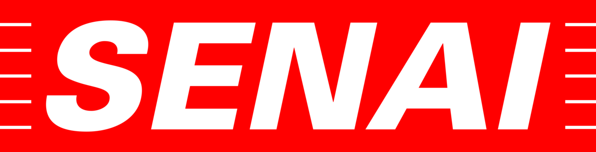

    

# PredialFix - API de Gestão de Manutenção Predial

## 👥 Equipe

| Nome | GitHub |
| :--- | :--- |
| **Guilherme Henrique Bernardi** |  |
| **Gustavo Franco Pereira** |  |
| **Victor Hugo Camargo** |  |

## 🔗 Links Úteis
* 🎨 **Figma:** [Design e Protótipo](https://www.figma.com/design/wOat0a545ZSXz97stFXDYt/Untitled?node-id=6-40&t=IVpmibyYZMTjSO8z-1)
* 📄 **Documentação (Word):** [Documentação Completa](./public/docs/Documentação.pdf)
* 📋 **Trello:** [Quadro de Tarefas](https://trello.com/invite/b/699f49744466b87a66481adb/ATTI1157e274c23bef217de53dbebbfcde277BF424A6/predialfix)

---

## 🚀 Processos e Metodologias

Abaixo estão detalhados os processos e metodologias adotados pela equipe para o desenvolvimento do PredialFix:

### 🛠️ Tecnologias e Ferramentas
> Utilização do ecossistema **Laravel** para garantir robustez e escalabilidade. A interface web é construída com **Blade** e **Tailwind CSS** para total fidelidade ao protótipo, enquanto o **Filament PHP** gerencia o back-office administrativo. O aplicativo mobile é desenvolvido em **Flutter** com **Dart**, consumindo a API e garantindo acesso à plataforma em qualquer lugar.

### 📋 Levantamento de Requisitos
> *Realizamos o mapeamento detalhado das necessidades para alinhar os objetivos do negócio e garantir a eficiência estrutural do protótipo.*

### 🎨 Prototipagem
> *Criada no Figma com foco em interfaces intuitivas (UI) e na melhor experiência (UX) para os futuros usuários da plataforma.*

### 🏃 Metodologias Ágeis
> *Gerenciamento de tarefas e fluxo de trabalho estruturados no Trello, aplicando as práticas e cerimônias da metodologia Scrum.*

### 🌿 Versionamento
> *Controle de versão e colaboração de código centralizados no GitHub, assegurando um histórico seguro e organizado de commits.*

### 📚 Documentação
> *Elaborada no Microsoft Word para detalhar as regras de negócio e os aspectos técnicos de forma clara, acessível e profissional.*

---

